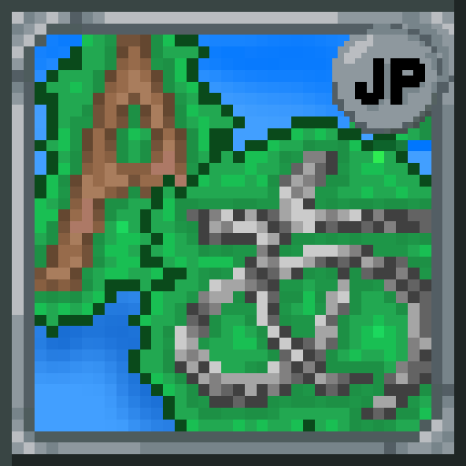

<H1>ExternalLocalizer-Jp-Pack </H1>

  
  
  

## 概要
[TMLHonyaku](https://github.com/ExternalLocalizer/TMLHonyaku)で公開されている日本語化ファイルを、簡単に[ExternalLocalizer](https://steamcommunity.com/sharedfiles/filedetails/?id=2986383249)で使用できるModです。
現在対応しているModの一覧は[TranslatedMods.csv](https://github.com/ExternalLocalizer/TMLHonyaku/blob/main/TranslatedMods.csv)を参照してください。

## 使い方
[External Localizer](https://steamcommunity.com/sharedfiles/filedetails/?id=2986383249)と[本Mod](https://steamcommunity.com/sharedfiles/filedetails/?id=3401890281)をサブスクライブし、ゲーム内のModリストから有効化してください。

その後ExternalLocalizerの設定画面で、以下の項目が正しく設定されていることを確認してください。
- `ローカライズを有効化`がオンになっていること
- `言語キー`が`ja-JP`に設定されていること

## 注意事項
- 本Modは手動更新のため、[TMLHonyakuリポジトリ](https://github.com/ExternalLocalizer/TMLHonyaku)と比べてやや更新が遅れる可能性があります。

分からないことがあれば、[Discord](https://discord.gg/ch2DVxf2jY)もしくはIssueにてお問い合わせください。
